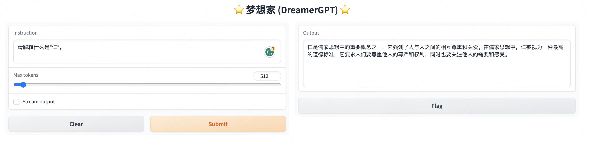
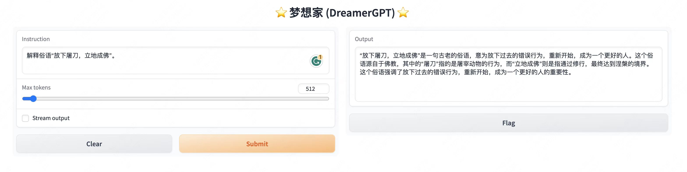
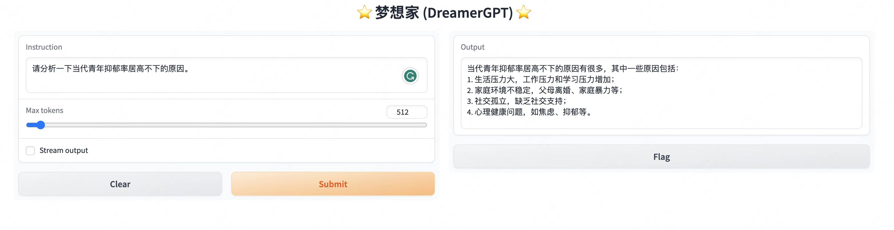

#  梦想家 (DreamerGPT): 中文大语言模型指令精调

🌱 **梦想家 (DreamerGPT) 是由[徐灏](kingsleyhsu1@gmail.com)， [迟慧璇](https://github.com/ytchx1999)，[贝元琛](https://github.com/YuanchenBei)，[刘丹阳](https://github.com/danyang-liu)发起的中文大语言模型指令精调项目。**

*👉 Read in [English version](README_EN.md)*.

<div align=center>

</div> 
<br>

<p align="center">
    
    
    
    
</p>


----

##  1、项目介绍

**本项目的目标是促进中文大语言模型在在更多垂直领域场景的应用。**

我们的目标是把大模型做小，帮助每一个人都能训练和在自己的垂直领域拥有一个个性化的专家助手，他可以是心理咨询师，可以是私人助理，也可以是自己的语言家教，也就是说DreamerGPT是一个效果尽可能好，训练代价尽可能低，并在中文上有更多优化的一个语言模型。DreamerGPT项目会持续开放迭代语言模型热启训练（包括LLama、BLoom（*coming soon*））、指令训练，强化学习、垂直领域精调，也会持续迭代可靠的训练数据和评测目标。由于项目人员和资源有限，目前V0.1版本针对LLama7B和LLama13B在[Chinese LLaMa](https://github.com/ymcui/Chinese-LLaMA-Alpaca)上做优化，增加中文特色、语言对齐等能力。目前在长对话能力和事理逻辑推理上仍有欠缺，更多迭代计划请详见[下一版更新内容](#7、下一版更新内容)。

以下是基于8b的量化demo，目前推理加速和性能优化也在迭代中：


*Demo展示：*

<div align=center>



</div> 

---

##  2、最近更新

**[2023/04/23]** 正式开源中文指令精调大模型----**梦想家（DreamerGPT）**，目前提供v0.1版本下载体验

已有模型（持续增量训练中，更多模型待更新）：

| 模型名称   | 训练数据                                                     | 权重路径                         | 权重下载                                                     |
| ---------- | ------------------------------------------------------------ | -------------------------------- | ------------------------------------------------------------ |
| D13b-1-3-1 | Chinese-alpaca-lora-13b-热启动 + COIG-part1、COIG-translate + PsyQA-5 | `output/rerun-1-alpaca-13b-3-1/` | [[Google Drive](https://drive.google.com/file/d/1PKT32_IMaHyE2qdt_W40Y6wxk3HVIma-/view?usp=sharing)] [[HuggingFace](https://huggingface.co/DreamerGPT/D13b-1-3-1/tree/main)] |
| D13b-2-2-2 | Chinese-alpaca-lora-13b-热启动 + firefly-train-0 + COIG-part1、COIG-translate | `output/rerun-2-alpaca-13b-2-2/` | [[Google Drive](https://drive.google.com/file/d/1WgzzKbc6IatBiHCcaQA5K74Y8fTEckSs/view?usp=sharing)] [[HuggingFace](https://huggingface.co/DreamerGPT/D13b-2-2-2/tree/main)] |
| D13b-2-3   | Chinese-alpaca-lora-13b-热启动 + firefly-train-0 + COIG-part1、COIG-translate + PsyQA-5 | `output/rerun-2-alpaca-13b-3/`   | [[Google Drive](https://drive.google.com/file/d/1sM2qNJcz0K43Y-MmhDXvw3hfqOtvzeNI/view?usp=sharing)] [[HuggingFace](https://huggingface.co/DreamerGPT/D13b-2-3/tree/main)] |
| D7b-4-1    | Chinese-alpaca-lora-7b-热启动 + firefly-train-0              | `output/run-4-alpaca-7b-1/`      | [[Google Drive](https://drive.google.com/file/d/1EAzMpgYA7nQ-9XR4NH4iwAtp83UIH3Bv/view?usp=sharing)] [[HuggingFace](https://huggingface.co/DreamerGPT/D7b-4-1/tree/main)] |

[模型测评抢先看](#Test)


---

## 3、模型和数据准备

### 3.1 模型

模型权重下载：

- [llama原始权重](https://github.com/facebookresearch/llama) 
- [chinese-llama/alpaca-lora权重](https://github.com/ymcui/Chinese-LLaMA-Alpaca)

### 3.2 数据

数据统一处理成以下的json格式：

```bash
{
    "instruction": "...",
    "input": "...",
    "output": "..."
}
```

数据下载以及预处理脚本:

| 数据                                                         | 类型             |
| ------------------------------------------------------------ | ---------------- |
| [Alpaca-GPT4](https://github.com/tloen/alpaca-lora/blob/main/alpaca_data_gpt4.json) | 英文             |
| [Firefly (预处理成多份，格式对齐)](https://github.com/DreamerGPT/DreamerGPT/tree/main/data/firefly) | 中文             |
| [COIG](https://github.com/DreamerGPT/DreamerGPT/tree/main/data/COIG) | 中文、代码、中英 |
| [PsyQA (预处理成多份，格式对齐)](https://github.com/DreamerGPT/DreamerGPT/tree/main/data/psyQA) | 中文心理咨询     |
| [BELLE](https://github.com/DreamerGPT/DreamerGPT/tree/main/data/belle) | 中文             |
| [baize](https://github.com/DreamerGPT/DreamerGPT/tree/main/data/baize) | 中文对话         |
| [Couplets (预处理成多份，格式对齐)](https://github.com/DreamerGPT/DreamerGPT/tree/main/data/couplets) | 中文             |

注：数据来源于开源社区，可通过链接访问。

---

##  4、训练代码和脚本

代码和脚本介绍：

- `finetune.py`：指令精调热启动/增量训练代码
- `generate.py`：推理/测试代码
- `scripts/`：运行脚本
  - 比如：`scripts/rerun-2-alpaca-13b-2.sh`，各参数解释见`scripts/README.md`

---

##  5、如何使用

### 5.1 环境安装

详细信息和相关问题请参考[Alpaca-LoRA](https://github.com/tloen/alpaca-lora)。

```bash
pip install -r requirements.txt
```

### 5.2 模型权重合并

权重融合（以alpaca-lora-13b为例）：

```bash
cd scripts/
bash merge-13b-alpaca.sh
```

参数含义（请自行修改相关路径）：

- `--base_model`, llama原始权重
- `--lora_model`, chinese-llama/alpaca-lora权重 
- `--output_dir`, 输出融合权重的路径

### 5.3 指令微调（可选）

以下面的训练流程为例，展示运行的脚本。

| start                                       | f1                    | f2                               | f3            |
| ------------------------------------------- | --------------------- | -------------------------------- | ------------- |
| Chinese-alpaca-lora-13b-热启动，实验序号：2 | 数据：firefly-train-0 | 数据：COIG-part1，COIG-translate | 数据：PsyQA-5 |

```bash
cd scripts/
# 热启动f1
bash run-2-alpaca-13b-1.sh
# 增量训练f2
bash rerun-2-alpaca-13b-2.sh
bash rerun-2-alpaca-13b-2-2.sh
# 增量训练f3
bash rerun-2-alpaca-13b-3.sh
```

重要参数解释（请自行修改相关路径）：

- 基础路径信息请参考[Alpaca-LoRA](https://github.com/tloen/alpaca-lora)。
- rerun的脚本自己写的时候注意加上。
- `--resume_from_checkpoint '前一次执行的LoRA权重路径'`
- 不需要inputs loss，修改 `--train_on_inputs False`
- 测试集的大小 `--val_set_size 2000` ，如果数据集本身就比较小，可适当减小，比如500， 200

### 5.4 推理/测评

**注意，如果想直接下载微调好的权重进行推理，那么可以忽略5.3，直接进行5.4。**

比如，我要测评`rerun-2-alpaca-13b-2.sh`微调后的结果：

1、网页版交互：

```bash
cd scripts/
bash generate-2-alpaca-13b-2.sh
```

2、批量推理并保存结果：

```bash
cd scripts/
bash save-generate-2-alpaca-13b-2.sh
```

重要参数解释（请自行修改相关路径）：

- `--is_ui False `：是否是网页版，默认为True
-  `--test_input_path 'xxx.json' `：输入的instruction路径
- 输出结果默认保存在对应LoRA权重目录下的`test.json`中

---

##  6、评测报告

<a name="Test"></a>

评测样例目前共有8类测试任务（数值伦理和多伦对话待测评），每一类10个样例，根据调用GPT-4/GPT 3.5的接口进行打分，每个样例打分范围0-10。评测样例见`test_data/`。

### 6.1 测试Prompt：

```bash
以下是五个类似 ChatGPT 的系统的输出。请以 10 分制为每一项打分，并给出解释以证明您的分数。输出结果格式为：System 分数；System 解释。
Prompt:xxxx。
答案：
System1:xxxx。
System2:xxxx。
System3:xxxx。
System4:xxxx。
System5:xxxx。
```
### 6.2 GPT 3.5打分：

| 测试任务     | 详细样例                                                     | 样例数 | D13b-1-3-1 | D13b-2-2-2 | D13b-2-3 | D7b-4-1 | ChatGPT |
| ------------ | ------------------------------------------------------------ | ------ | ---------- | ---------- | -------- | ------- | ------- |
| 每一项总分   | ---                                                          | 80     | 100        | 100        | 100      | 100     | 100     |
| 知识问答     | [01qa.json](https://github.com/DreamerGPT/DreamerGPT/blob/main/test_data/01qa.json) | 10     | 65         | 64         | 63       | 67*     | **89**  |
| **翻译**     | [02translate.json](https://github.com/DreamerGPT/DreamerGPT/blob/main/test_data/02translate.json) | 10     | 79         | 81         | 82       | 89*     | **91**  |
| 文本生成     | [03generate.json](https://github.com/DreamerGPT/DreamerGPT/blob/main/test_data/03generate.json) | 10     | 65         | 73*        | 63       | 71      | **92**  |
| **情感分析** | [04analyse.json](https://github.com/DreamerGPT/DreamerGPT/blob/main/test_data/04analyse.json) | 10     | 88*        | **91**     | 88*      | 85      | 71      |
| **阅读理解** | [05understanding.json](https://github.com/DreamerGPT/DreamerGPT/blob/main/test_data/05understanding.json) | 10     | 75         | 77         | 76       | 85*     | **91**  |
| **中文特色** | [06chinese.json](https://github.com/DreamerGPT/DreamerGPT/blob/main/test_data/06chinese.json) | 10     | 82*        | **83**     | 82*      | 40      | 68      |
| 代码生成     | [07code.json](https://github.com/DreamerGPT/DreamerGPT/blob/main/test_data/07code.json) | 10     | 72         | 74         | 75*      | 73      | **96**  |
| 伦理、拒答类 | [08alignment.json](https://github.com/DreamerGPT/DreamerGPT/blob/main/test_data/08alignment.json) | 10     | 71*        | 70         | 67       | 71*     | **94**  |
| 数值伦理     | （待评测）                                                   |   --     |      --      |     --       |     --     |   --      |      --   |--
| 多轮对话     | （待评测）                                                   |   --     |     --       |      --     |     --    |     --    |    --     |

模型在**翻译**、**情感分析**、**阅读理解**、**中文特色**等方面都有不错的表现。

### 6.3 GPT 4打分

coming soon.


---

##   7、下一版更新内容


TODO List：

- [ ] 长文本和对话能力训练
- [ ] 代码和文本生成能力
- [ ] 多轮对话app开发
- [ ] Bloom中文框架
- [ ] 更宽泛领域的评测体系和方案

---

##  局限性、使⽤限制与免责声明

基于当前数据和基础模型训练得到的SFT模型，在效果上仍存在以下问题：

- 在涉及事实性的指令上可能会产生违背事实的错误回答。

- 对于具备危害性的指令无法很好的鉴别，可能会产生歧视、危害、违背伦理道德的言论。

- 在一些涉及推理、代码、多轮对话等场景下模型的能力仍有待提高。

**基于以上模型的局限性，我们要求本项目的内容及后续用此项目生成的衍生物仅可应用于学术研究目的，不得用于商业用途及对社会造成危害的用途。项目开发者不承担任何因使用本项目（包含但不限于数据、模型、代码等）导致的任何危害、损失或法律责任。**


---

##  引⽤
如果您使用本项目的代码、数据或模型，请您引用本项目。
```
@misc{DreamerGPT,
  author = {Hao Xu, Huixuan Chi, Yuanchen Bei and Danyang Liu},
  title = {DreamerGPT: Chinese Instruction-tuning for Large Language Model.},
  year = {2023},
  publisher = {GitHub},
  journal = {GitHub repository},
  howpublished = {\url{https://github.com/DreamerGPT/DreamerGPT}},
}
```

---

##  联系我们

本项目仍有很多不足，请大家多提建议和问题，我们会尽力完善本项目。

邮箱：dreamergpt@gmail.com
